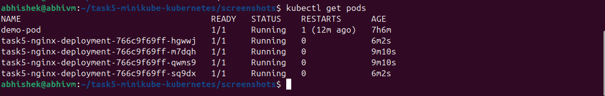
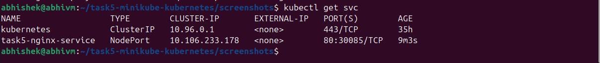

# 🧩 TASK 5 — Build a Kubernetes Cluster Locally with Minikube

## 🎯 Objective
The goal of this task was to learn the basics of **Kubernetes** by running it locally using **Minikube**.  
I deployed a simple **Nginx web server**, exposed it with a **service**, checked the pods, scaled the deployment, and explored logs.  
This task helped me understand how Kubernetes manages applications using **pods**, **deployments**, and **services**.

---

## 🧰 Tools and Technologies Used
- **Minikube** → To create a local Kubernetes cluster  
- **kubectl** → To manage and interact with the cluster  
- **Docker** → Used as the container runtime for Minikube  
- **Nginx** → A simple web server used as the demo application  
- **VS Code / Terminal** → For writing YAML files and running commands  

---

## 🪜 Step-by-Step Process

###  Step 1 — Starting Minikube
minikube start --driver=docker
minikube status

###  Step 2 — Creating a Deployment
I wrote the YAML file named deployment-task5.yaml and applied it:
kubectl apply -f deployment-task5.yaml
To verify that pods are running:
kubectl get pods
Screenshot:

###  Step 3 — Creating a Service
I created another YAML file named service-task5.yaml and applied it:
kubectl apply -f service-task5.yaml
To verify the service: 
kubectl get svc

###  Step 4 — Accessing the Application
To access the Nginx application in my browser, I used:
minikube service task5-service

###  Step 5 — Scaling the Deployment
To scale the number of pods, I used:
kubectl scale deployment task5-deployment --replicas=4
To confirm the scaling:
kubectl get pods

###  Step 6 — Checking Pod Details and Logs
To describe a specific pod:
kubectl describe pod <pod-name>
To check the logs of a pod:
kubectl logs <pod-name>

###  Step 7 — Cleanup
kubectl delete -f deployment-task5.yaml
kubectl delete -f service-task5.yaml
minikube stop

